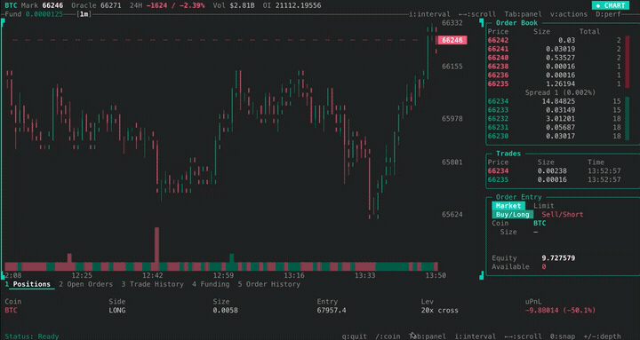

<p align="center">
  <picture>
    <source media="(prefers-color-scheme: dark)" srcset="docs/public/hlz-wordmark-dark.svg">
    <source media="(prefers-color-scheme: light)" srcset="docs/public/hlz-wordmark-light.svg">
    
  </picture>
</p>

<p align="center">
  Zig tooling for <a href="https://hyperliquid.xyz">Hyperliquid</a> — SDK, CLI, and trading terminal.
</p>

<p align="center">
  
</p>


<p align="center">
  <a href="#install">Install</a> ·
  <a href="#quick-start">Quick Start</a> ·
  <a href="https://vaniiiii.github.io/hlz">Docs</a> ·
  <a href="#credits">Credits</a>
</p>

---

## What is this

A Zig implementation of the Hyperliquid SDK with a CLI and trading terminal. Two binaries:

| Binary | Size | What it does |
|--------|------|-------------|
| `hlz` | 636 KB | 38-command CLI — market data, trading, transfers, streaming |
| `hlz-terminal` | 768 KB | Trading terminal — candlestick chart, order book, trade tape |

Both are static binaries. Pipe-aware — tables on TTY, JSON when piped.

---

## Install

**Download a binary** from [Releases](../../releases/latest):

```bash
# macOS (Apple Silicon)
curl -fsSL -o hlz https://github.com/vaniiiii/hlz/releases/latest/download/hlz-darwin-arm64
chmod +x hlz && mv hlz /usr/local/bin/

# Linux (x64, static)
curl -fsSL -o hlz https://github.com/vaniiiii/hlz/releases/latest/download/hlz-linux-x64
chmod +x hlz && mv hlz /usr/local/bin/
```

**From source** (requires [Zig 0.15.2](https://ziglang.org/download/)):

```bash
git clone https://github.com/vaniiiii/hlz
cd hlz
zig build -Doptimize=ReleaseSmall
# Binaries in zig-out/bin/hlz and zig-out/bin/hlz-terminal
```

**As a Zig dependency:**

```zig
.dependencies = .{
    .hlz = .{
        .url = "git+https://github.com/vaniiiii/hlz#main",
    },
},
```

---

## Quick Start

```bash
# No auth needed for market data
hlz price BTC
hlz book ETH --live
hlz funding --top 10

# Set up a key for trading
hlz keys new trading
export HL_KEY_NAME=trading

# Trade
hlz buy BTC 0.1 @50000
hlz sell ETH 1.0
hlz cancel BTC --all

# Check account
hlz portfolio
hlz orders

# Stream real-time data
hlz stream trades BTC

# Trading terminal
hlz trade BTC
```

---

## SDK

```zig
const hlz = @import("hlz");
const Signer = hlz.crypto.signer.Signer;
const Decimal = hlz.math.decimal.Decimal;
const types = hlz.hypercore.types;
const signing = hlz.hypercore.signing;

const signer = try Signer.fromHex("your_64_char_hex_key");

const order = types.OrderRequest{
    .asset = 0,  // BTC
    .is_buy = true,
    .limit_px = try Decimal.fromString("50000"),
    .sz = try Decimal.fromString("0.1"),
    .reduce_only = false,
    .order_type = .{ .limit = .{ .tif = .Gtc } },
    .cloid = types.ZERO_CLOID,
};

const batch = types.BatchOrder{
    .orders = &[_]types.OrderRequest{order},
    .grouping = .na,
};

const nonce = @as(u64, @intCast(std.time.milliTimestamp()));
const sig = try signing.signOrder(signer, batch, nonce, .mainnet, null, null);

var client = hlz.hypercore.client.Client.mainnet(allocator);
defer client.deinit();
var result = try client.place(signer, batch, nonce, null, null);
defer result.deinit();
```

---

## CLI Commands

<details>
<summary><strong>Market Data</strong> (no auth)</summary>

| Command | Description |
|---------|-------------|
| `hlz price <COIN>` | Mid price + bid/ask spread |
| `hlz mids [COIN]` | All mid prices |
| `hlz funding [--top N]` | Funding rates |
| `hlz book <COIN> [--live]` | L2 order book |
| `hlz perps [--dex xyz]` | Perpetual markets |
| `hlz spot` | Spot markets |
| `hlz dexes` | HIP-3 DEXes |

</details>

<details>
<summary><strong>Trading</strong></summary>

| Command | Description |
|---------|-------------|
| `hlz buy <COIN> <SZ> [@PX]` | Limit or market buy |
| `hlz sell <COIN> <SZ> [@PX]` | Limit or market sell |
| `hlz cancel <COIN> [OID]` | Cancel order(s) |
| `hlz modify <COIN> <OID> <SZ> <PX>` | Modify order |
| `hlz leverage <COIN> [N]` | Query or set leverage |
| `hlz twap <COIN> buy\|sell <SZ> --duration 1h --slices 10` | TWAP execution |
| `hlz batch "order1" "order2"` | Batch orders |

**Flags:** `--reduce-only`, `--tp <PX>`, `--sl <PX>`, `--tif gtc|ioc|alo`, `--dry-run`

</details>

<details>
<summary><strong>Account</strong></summary>

| Command | Description |
|---------|-------------|
| `hlz portfolio [ADDR]` | Positions + spot balances |
| `hlz positions [ADDR]` | Open positions |
| `hlz orders [ADDR]` | Open orders |
| `hlz fills [ADDR]` | Recent fills |
| `hlz balance [ADDR]` | Balance + margin health |
| `hlz status <OID>` | Order status |

</details>

<details>
<summary><strong>Transfers & Streaming</strong></summary>

```bash
hlz send 100 USDC 0xAddress        # Send to address
hlz send 100 USDC --to spot        # Perp → spot

hlz stream trades BTC               # Real-time trades
hlz stream book ETH                 # Order book updates
```

</details>

<details>
<summary><strong>Key Management</strong></summary>

```bash
hlz keys new <NAME>                  # Generate encrypted key
hlz keys import <NAME>               # Import existing key
hlz keys ls                          # List keys
hlz keys default <NAME>              # Set default
hlz approve-agent <ADDR>             # Approve API wallet
```

</details>

<details>
<summary><strong>Global Flags & Environment</strong></summary>

```
--json              JSON output (auto when piped)
--quiet, -q         Minimal output
--chain testnet     Use testnet
--dry-run, -n       Preview without sending
--key-name <NAME>   Select keystore key
```

```bash
HL_KEY=...          # Private key
HL_ADDRESS=...      # Default address
HL_CHAIN=...        # mainnet or testnet
HL_OUTPUT=json      # Default format
```

Exit codes: `0` success, `1` error, `2` usage, `3` auth, `4` network

</details>

---

## Agent Integration

Built for automation and AI agents:

- JSON when piped, `--json` flag always available
- Semantic exit codes (0/1/2/3/4)
- `--dry-run` to preview any trade
- `--quiet` for just the value
- Stdin batch: `echo "buy BTC 0.1" | hlz batch --stdin`
- No interactive prompts ever

```bash
PRICE=$(hlz price BTC -q)
hlz buy BTC 0.1 @${PRICE} --json
hlz orders --json | jq '.[] | select(.coin == "BTC")'
```

---

## Architecture

```
src/
├── lib/          Primitives (crypto, encoding, math) — no Hyperliquid knowledge
├── sdk/          Hyperliquid SDK (client, ws, signing, types) — imports lib/
├── tui/          TUI framework (Buffer, Terminal, Layout, List, Chart) — standalone
├── cli/          CLI tool (38 commands) — imports sdk/ + tui/
└── terminal/     Trading terminal — imports sdk/ + tui/
```

Dependencies point down only. `lib/` and `tui/` depend on nothing.

---

## Numbers

| | |
|---|---|
| `hlz` binary | 636 KB |
| `hlz-terminal` binary | 768 KB |
| SDK (no HTTP/TLS) | 116 KB |
| Source | ~15,000 lines |
| Commands | 38 |
| HTTP endpoints | 30 (18 info + 12 exchange) |
| WS subscriptions | 13 types |
| Response types | 62 |
| Unit tests | 108 |
| E2E tests | 17 |

---

## Building

```bash
zig build                              # Debug
zig build -Doptimize=ReleaseSmall      # Small binary (636KB)
zig build -Doptimize=ReleaseFast       # Fast binary
zig build test                         # Unit tests
zig build bench                        # Signing benchmarks
zig build e2e                          # Live API tests
```

---

## Credits

Inspired by [hypersdk](https://github.com/infinitefield/hypersdk) (Rust SDK), [hyperliquid-cli](https://github.com/chrisling-dev/hyperliquid-cli) (TypeScript CLI), and [zabi](https://github.com/Raiden1411/zabi) (Zig Ethereum tooling).

<p align="center">
  <a href="https://ziglang.org"></a>
  &nbsp;&nbsp;×&nbsp;&nbsp;
  <a href="https://hyperliquid.xyz"></a>
</p>

---

MIT · Not affiliated with Hyperliquid.
